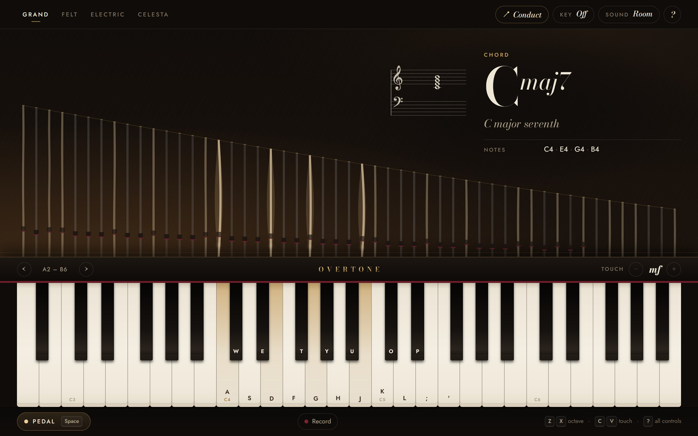
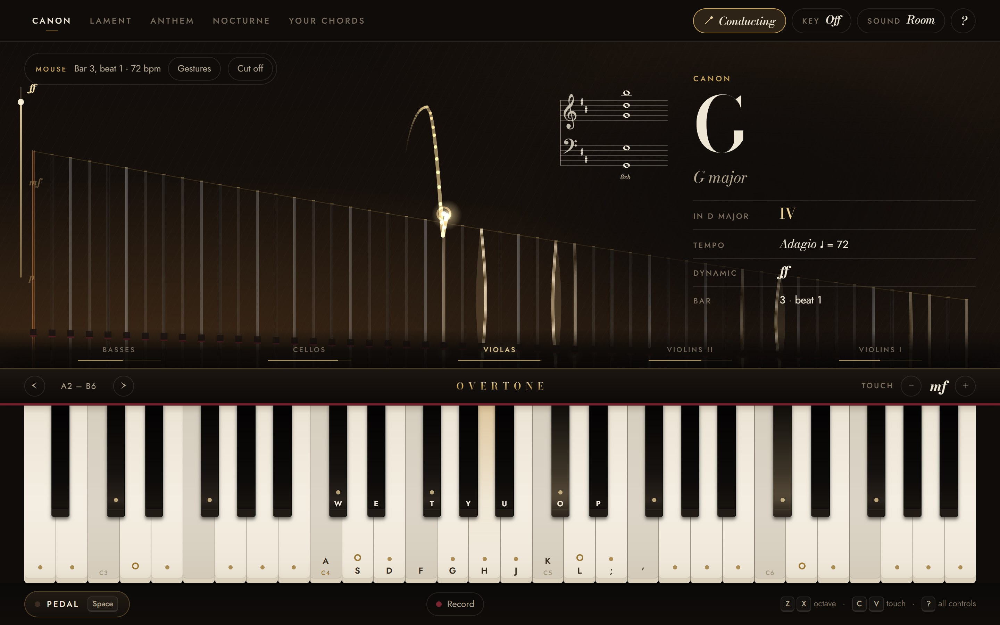
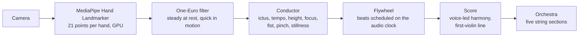

# Overtone

**A piano you can see inside, and a string orchestra you conduct with your hands.**

Play in the browser and watch the strings under the lid. Every note, interval and chord is named as you play and engraved on a grand staff. Then pick up the baton: raise a hand in front of your camera, and a string orchestra follows your beat.

### [**Play it → royverse.github.io/piano**](https://royverse.github.io/piano/)



---

## The piano

- **Four instruments, no samples.** Grand, Felt, Electric and Celesta are synthesised note by note in a Web Worker. The model has stiff-string inharmonicity, beating unison strings, a two-stage decay and a felt-and-wood hammer thump, and the room comes from a generated impulse response. Nothing is downloaded but the code.
- **Strings that show what you hear.**
  - Each key strikes its own strings: one copper-wound string in the low bass, two in the tenor, three steel strings above.
  - Hold the pedal and the felt dampers lift, so strings whose overtones match your note start to ring on their own (sympathetic resonance). The number of loops on a string shows which overtone it's answering.
  - As on a real piano, the top octave and a half has no dampers.
- **A readout that names it.** Notes come with their frequency, intervals with their frequency ratio, and chords with inversions and slash bass. Spelling follows the interval, so C–E♭ is a minor third, never C–D♯. Everything is engraved on a grand staff with key signature, ledger lines and 8va.
- **Play in a key.** Pick one on the circle of fifths:
  - its scale is marked on the keys;
  - every chord gets its roman numeral (V7, ii, ♭VII, V7/V);
  - keys <kbd>1</kbd>–<kbd>7</kbd> play the key's chords;
  - *Stay in key* maps your letter rows to the scale;
  - *Just intonation* retunes to pure intervals.
- **However you like to play.** Computer keyboard (by physical key, so any layout works), mouse, multi-touch with glissando, or a MIDI keyboard with its own velocity and sustain pedal.
- **Record and share.** A take is compressed into the link itself, so sharing needs no server.

| Key | Does |
| --- | --- |
| <kbd>A</kbd> <kbd>S</kbd> <kbd>D</kbd> <kbd>F</kbd> <kbd>G</kbd> <kbd>H</kbd> <kbd>J</kbd> <kbd>K</kbd> <kbd>L</kbd> <kbd>;</kbd> <kbd>'</kbd> | White keys, from C |
| <kbd>W</kbd> <kbd>E</kbd> <kbd>T</kbd> <kbd>Y</kbd> <kbd>U</kbd> <kbd>O</kbd> <kbd>P</kbd> | Black keys |
| <kbd>Space</kbd> | Sustain pedal (hold) |
| <kbd>Z</kbd> / <kbd>X</kbd> | Octave down / up |
| <kbd>C</kbd> / <kbd>V</kbd> | Softer / louder, from *pp* to *ff* |
| <kbd>1</kbd>–<kbd>7</kbd> | Chords of the key (hold <kbd>Shift</kbd> for sevenths) |
| <kbd>?</kbd> | How to play |

## The orchestra



Choose **Conduct** and the orchestra tunes: an oboe gives the A and the strings slide into tune. Raise your hand and they fall silent, watching you. Your first beat starts the music. From then on they keep flowing at your tempo while you conduct, and every beat you give pulls them back into step. Hold still for a fermata, close your hand to stop them together, and finish a strong performance to hear the hall applaud.

| Gesture | What the orchestra does |
| --- | --- |
| Beat down and let your hand bounce up | Plays on the beat and follows your tempo, from *adagio* to *presto* |
| Raise or lower your hand | Louder or softer, *pp* to *ff*; conduct harder and the violins play busier lines |
| Point left or right | Brings the cellos and basses, or the violins, forward |
| Raise both hands | A *tutti* swell |
| Pinch thumb and index finger | *Pizzicato*: the strings are plucked, not bowed |
| Hold still | A fermata: they hold the chord and let it fade |
| Close your hand into a fist | Everyone stops together |

What they play: a **Canon** after Pachelbel, a **Lament** on the Andalusian cadence, an **Anthem** on I–V–vi–IV, a **Nocturne** of seventh chords, or **Your chords**, which follows whatever you hold on the piano while you conduct with the other hand. No camera? Drag or tap on the stage, or press <kbd>Space</kbd> on each beat.

Hand tracking runs entirely in the browser; the camera image never leaves your device.

## How it works

**Sound.**
- **Piano notes** are rendered off the main thread by `src/audio/synth.js`. Each note is a sum of decaying partials, computed with two-pole resonators rather than a `sin()` per sample. The model includes string stiffness, a hammer strike point, unison detuning and a separate aftersound.
- **Playback:** the Web Audio engine adds velocity-dependent brightness, damping, the pedal, sympathetic "bloom" and the room.
- **The orchestra** is synthesised live, so it can follow you: every section is a few detuned sawtooth players, each with its own vibrato. They pass through violin-family body resonances and a bow-pressure filter, with a little rosin noise, into a concert hall.
- **The applause** is built clap by clap.

**Conducting**, from camera to sound:



- **Conductor** (`gesture.js`): finds each beat at the bottom of a downstroke (the *ictus*), reads the tempo from the gaps between beats, and turns hand height and stroke size into dynamics.
- **Flywheel** (`conduct.js`): keeps the orchestra in time between your beats, and uses each beat you give to correct its phase.
- **Score** (`score.js`): voices the progression across basses, cellos, violas and two violin sections. It fills in each chord, keeps the inner parts moving smoothly, and writes a first-violin line that gets busier the harder you conduct.

**Theory.** `src/theory.js` spells notes by interval, identifies 32 chord types (with inversions and no-fifth voicings), and names each chord's function in the key. It is pure and fully unit-tested.

## Project structure

```
index.html              The page
styles.css              Everything visual: lacquer, brass, ivory and felt
src/
  main.js               Wires it together: input, state, panels, takes
  theory.js             Spelling, keys, intervals, chords, roman numerals
  keyboard.js           Keys with real piano proportions; pointer input
  strings.js            The view under the lid
  staff.js              Grand-staff engraving in SVG
  readout.js            The note / interval / chord readout
  take.js               Recording, playback and link encoding
  midi.js · settings.js MIDI input · saved preferences
  audio/
    synth.js            Offline note synthesis (runs in render-worker.js)
    engine.js           Web Audio playback, dampers, pedal, room
    orchestra.js        The string orchestra, oboe and applause
  conduct/
    conduct.js          Conduct mode: the concert, start to finish
    gesture.js          Beats, tempo, dynamics and cut-offs from hand motion
    score.js            Progressions voiced for five string sections
    hands.js            Camera and MediaPipe hand tracking
    filter.js           One-Euro smoothing for tracked landmarks
    baton.js            Baton trail, beat ripples, dynamics gauge
    hand-model.js       The animated gesture guide
models/                 The MediaPipe hand model, served locally
tests/                  Unit tests (node --test)
scripts/serve.js        A zero-dependency dev server
docs/                   Screenshots
```

## Run it locally

No build step and no dependencies: plain HTML, CSS and ES modules.

```bash
npm start
```

That serves the app at http://localhost:5173. Any static server works, as long as it sends `.js` as JavaScript. The camera needs `localhost` or HTTPS.

```bash
npm test
```

The tests use Node's built-in test runner (Node 20+). They cover the music theory, that every note of every instrument renders cleanly, beat and tempo detection, orchestral voicing, hand-landmark smoothing, and shared takes.

## Deploy

Every push to `main` runs the tests, then publishes the site to GitHub Pages with the workflow in `.github/workflows/deploy.yml`.

## Browsers

Current Chrome, Edge, Firefox and Safari, on desktop and mobile. MIDI keyboards work where the Web MIDI API is available (Chrome, Edge, Firefox). Camera conducting needs a webcam and a browser that can run MediaPipe's WebAssembly; the GPU is used when available.

## Credits

- Hand tracking: [MediaPipe Hand Landmarker](https://ai.google.dev/edge/mediapipe/solutions/vision/hand_landmarker) by Google, Apache License 2.0 (see [`models/`](models/)).
- Type: [Bodoni Moda](https://fonts.google.com/specimen/Bodoni+Moda), [Jost](https://fonts.google.com/specimen/Jost) and [Noto Music](https://fonts.google.com/noto/specimen/Noto+Music), SIL Open Font License, via Google Fonts.
- The *Canon* follows the harmony of Johann Pachelbel's Canon in D.
